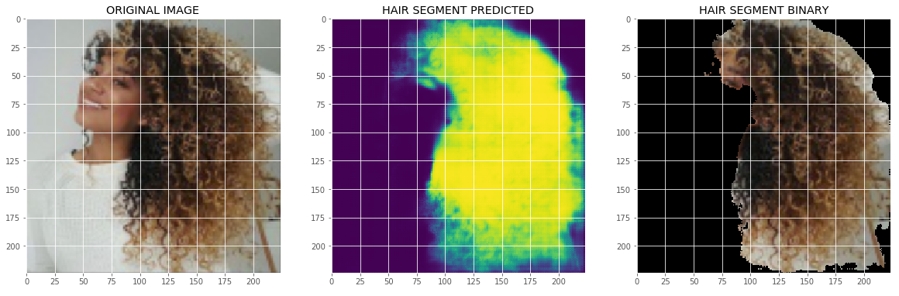

# Hair segmentation and classification with Unet and GoogleNet

This repository contains the implementation of a deep learning algorithm to classify hair types from images. It consists of two separate CNNs:
- One CNN is used to segment hair in face images. This is a binary classification task: the neural network predicts if each pixel in the image is either hair or non-hair. This neural network structure is derived from the U-Net architecture, described in this [paper](https://arxiv.org/abs/1505.04597). The performance of this segmentation network is tested on the [LFW | Part Labels Database](http://vis-www.cs.umass.edu/lfw/part_labels/) and achieve an accuracy of 92%, that is the best score from papers we have read so far.

- One other CNN is used to classify hair segment into type a, b or c. This is a GoogleNet architecture
Hair Segmentation uses a U-Net architecture to segment hair pixels from images.
The folder weights contains the pre-trained weights for segmentation and classification. The folder libs contains the functions used by main files.

# Requirements:
- Tensorflow >= 1.12
- Keras
- Skimage
- Opencv
- PIL >= 1.1.7

# Part I: Segmentation

-You need to create a folder datasets and insert three folders for the 'funneled images', 'Ground Truth Images' and 'Ground  Truth Labels' that you will download from this [link](http://vis-www.cs.umass.edu/lfw/part_labels/). 
- Then run the file create_dataset.py to create and process the training data.
- Run train.segmentation to train the network for segmentation
- Run test_segmentation to test the segmentation on test images. The test images should be 224x224x3 and you need to store hair segment in a folder for data augmentation and hair classification

# Part II: Data Augmentation
Use data_augmentation.py and the hair segment obtained from Part I to apply random transformations and increase the volume of hair segments. Store the files in a folder

# Part II: Classification
Use train_classification.py to train the network for classifying hair type.
